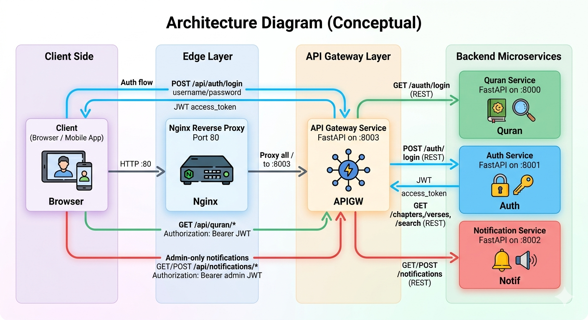

## Quran Microservice

This project is a **production-grade microservice** built around Quran content, using the public JSON data from `quran-json` (`cdn.jsdelivr.net/npm/quran-json@3.1.2/dist/`).

It is designed to showcase:

- **Clean Architecture**
- **REST API design**
- **Containerization (Docker)**
- **CI/CD concepts (GitHub Actions-style workflow)**
- **Observability (logging & basic health checks)**
- **Security basics (validation, CORS, configuration)**
- **Optional AI integration (pluggable service interface)**

### Tech Stack

- **Language**: Python 3.11+
- **Framework**: FastAPI
- **Server**: Uvicorn

### High-Level Architecture

- **`app/domain`**: Pure domain models (Chapters, Verses, Language) and abstractions.
- **`app/application`**: Use-cases / services (search, retrieval, language handling).
- **`app/infrastructure`**: Adapters to the outside world (Quran JSON loader from CDN, logging config, settings).
- **`app/interfaces/api`**: FastAPI routes, request/response schemas, HTTP concerns only.

All Quran data is **loaded once on startup** from the CDN and cached in memory for fast access. This keeps the example simple while still realistic. Swapping in a database later only touches infrastructure.

### Core Endpoints (planned)

- `GET /health` – health check.
- `GET /chapters` – list all chapters (with metadata).
- `GET /chapters/{chapter_id}` – single chapter details.
- `GET /chapters/{chapter_id}/verses` – verses of a chapter, optional `?lang=en` etc.
- `GET /verses/{chapter_id}/{verse_number}` – a specific verse, optional `?lang=en`.
- `GET /search` – basic full-text search across verses: `?q=mercy&lang=en`.

Languages are mapped to the files in the CDN: `quran_en.json`, `quran_fr.json`, etc.

### Running Locally

#### 1. Install dependencies

```bash
cd /home/wal8y/Desktop/quran
python3 -m venv .venv
source .venv/bin/activate
pip install -r requirements.txt
```

#### 2. Run the service

```bash
uvicorn app.main:app --reload
```

Service will be available at `http://localhost:8000`.

### Docker

Build and run:

```bash
docker build -t quran-service .
docker run -p 8000:8000 quran-service
```

### CI/CD Concept

The `.github/workflows/ci.yml` file (example) shows a **conceptual pipeline**:

- Install dependencies
- Run tests
- Build Docker image

You can plug this into GitHub Actions (or similar CI systems).

### Observability & Security

- **Logging**: structured application logging via Python `logging`, request logs via FastAPI/Uvicorn.
- **Health**: `GET /health` for liveness.
- **Security basics**:
  - Input validation via Pydantic / FastAPI.
  - CORS configuration (allowed origins via config).
  - No secrets checked into source (config via env vars).

### Optional AI Integration

The `app/application/ai_service.py` file (planned) will define an **interface** for AI-based features (e.g., summarizing verses, generating study questions). Actual calls to an external AI provider can be plugged in later using environment variables and an implementation class in `app/infrastructure`.

### Distributed System Extension

This repository also demonstrates a **multi-microservice distributed architecture**:

- **`app`** – Quran service (content & search).
- **`auth_service`** – Authentication service (JWT issuance, demo users).
- **`notification_service`** – Notification service (in-memory notifications).
- **`api_gateway`** – API Gateway fronting the other services, enforcing auth.

All services are containerized and orchestrated via `docker-compose.yml`.

#### Architecture Diagram (Conceptual)


- **Client** talks only to the **API Gateway**.
- **API Gateway** validates JWT tokens and enforces **authorization** (e.g., admin-only for notifications).
- **Auth Service** issues signed JWT tokens.
- **Quran Service** and **Notification Service** remain unaware of auth; they trust the gateway.

#### Service Communication

- **Service-to-service communication** is done via **REST** using `httpx`:
  - Gateway → Auth (`/auth/login`).
  - Gateway → Quran (e.g., `/chapters`, `/search`).
  - Gateway → Notification (`/notifications`).
- Each service has its own FastAPI app, own port, and its own Docker configuration (via `docker-compose.yml`).

#### API Gateway Responsibilities

- **Single entrypoint** for clients: `http://localhost:8003`.
- Routes:
  - `POST /api/auth/login` → forwards credentials to Auth Service and returns a JWT token.
  - `GET /api/quran/*` → proxies read-only Quran endpoints (requires any authenticated user).
  - `GET/POST /api/notifications/*` → proxies notification endpoints (requires `admin` role).
- **Authentication**: extracts `Authorization: Bearer <token>` and validates JWT with shared secret.
- **Authorization**: checks the `role` claim inside the token (`user` or `admin`) before forwarding.

#### Auth Service

- Endpoints:
  - `POST /auth/login` – accepts username/password, returns `{"access_token": "...", "token_type": "bearer"}`.
  - `GET /auth/users/me?token=...` – decodes token and returns user info (for demo/debug).
- Uses an **in-memory user store**:
  - `alice` / `password` – role `user`.
  - `admin` / `admin` – role `admin`.
- Passwords are hashed using a simple SHA-256 helper (for demo only).
- Issues JWTs signed with `AUTH_SECRET_KEY` (shared with the Gateway via env vars).

#### Notification Service

- Endpoints:
  - `POST /notifications` – create a notification (`recipient`, `message`).
  - `GET /notifications` – list all notifications.
- Stores notifications **in memory** with auto-incrementing IDs and timestamps.
- In a real system this could be backed by a message queue (e.g., RabbitMQ or Kafka) or a database.

#### Running the Distributed Setup (Docker Compose)

From the project root:

```bash
docker-compose up --build
```

This will start:

- **Quran Service** on `http://localhost:8000`
- **Auth Service** on `http://localhost:8001`
- **Notification Service** on `http://localhost:8002`
- **API Gateway** on `http://localhost:8003`
- **Nginx reverse proxy** on `http://localhost/` (port 80)

Example flow:

1. **Login** via Gateway:
   - `POST http://localhost:8003/api/auth/login`
   - Body (form data): `username=alice&password=password`
   - Receive `access_token`.
2. **Call Quran API through Gateway (via Nginx)**:
   - `GET http://localhost/api/quran/chapters`
   - Header: `Authorization: Bearer <access_token>`
3. **Admin-only Notifications**:
   - Login as `admin` via step 1.
   - `POST http://localhost:8003/api/notifications/notifications`
   - JSON body: `{ "recipient": "alice", "message": "New chapter available" }`
   - Header: `Authorization: Bearer <admin_token>`

This setup covers:

- **Microservice architecture** (Quran, Auth, Notification, Gateway).
- **Service communication** via REST.
- **API gateway** pattern.
- **Authentication / Authorization** using JWT and roles.
- **Distributed system basics** with Docker and `docker-compose`.

### API Documentation (Swagger / OpenAPI)

Each FastAPI service automatically exposes interactive API documentation (Swagger UI):

- **Quran Service**: `http://localhost:8000/docs`
- **Auth Service**: `http://localhost:8001/docs`
- **Notification Service**: `http://localhost:8002/docs`
- **API Gateway (direct)**: `http://localhost:8003/docs`
- **API Gateway (via Nginx)**: `http://localhost/docs`

You can use these UIs to:

- Inspect the OpenAPI schemas.
- Try requests directly from the browser (including adding the `Authorization: Bearer <token>` header for secured routes).

Nginx is used here as an **edge reverse proxy**, forwarding all incoming HTTP traffic on port 80 to the API Gateway container. In a real production setup you could extend this to handle HTTPS termination, static assets, rate limiting, etc.
